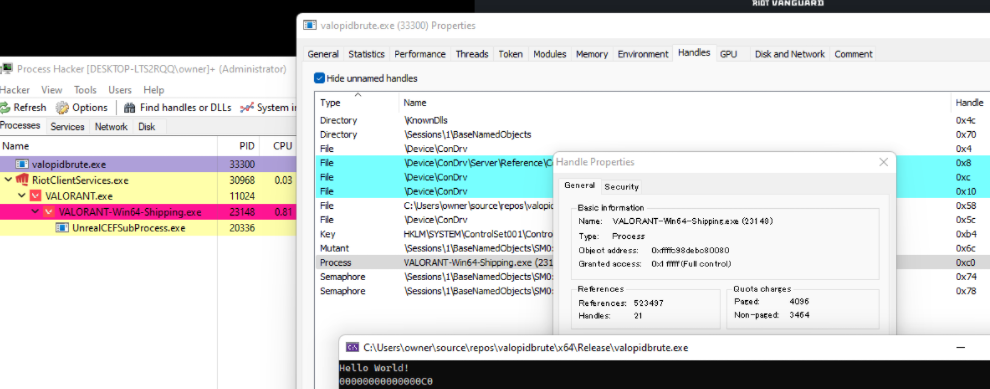
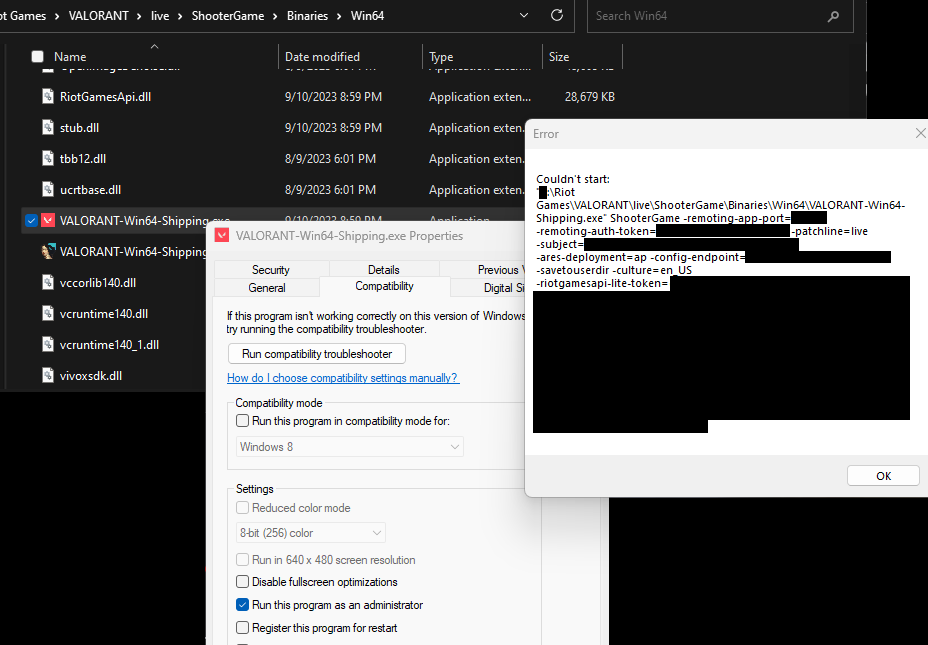
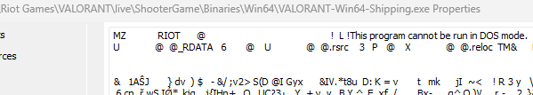
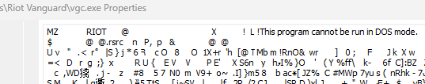

[PoC Video](./assets/2021-12-21_23-18-41.mp4)

# Van1338: Design Flaw in Riot Vanguard: $6,000

A design flaw in Riot Vanguard could allow arbitrary user to acquire a full privileged process handle.



# The Complexity of Windows Object Callback Design

Riot Vanguard uses `ObRegisterCallbacks` to protect the user-mode processes, a commonplace procedure to protect one process from another by auditing and modifying process handle access masks.

`PsSetCreateProcessNotifyRoutineEx` is also known for its combined use with object callback to determine the processes requiring protection.

This bounty disclosed a potential design flaw in the utilization of this API combination, upon which Riot Vanguard was dependent.

This bug is also replicable on Easy Anti Cheat.

## The Object Callback Timing Attack

The process creation procedure in Windows systems is notably intricate due to factors such as UAC prompts and intermediation by PCA (_Program Compatibility Assistant_). Several procedures must be completed before entering the `NtCreateUserProcess` system call.

This bug is substantiated by the ability of **object callbacks to be invoked right before the process callbacks** during the process creation phase.

Why? Simple. the creator process necessitates specific mandatory access masks, including `PROCESS_VM_READ` and `PROCESS_VM_WRITE`, for covert PEB (Process Environment Block) patches[^1].

Hence, the crux of this bug was straightforward: determining how quickly the `NtOpenProcess` system call could be issued.

```c
void poc()
{
    for(;;)
    {
        auto valorant_pid = GetValorantProcessId();
        OBJECT_ATTRIBUTES oa = {};
        InitializeObjectAttributes(&oa, NULL, 0, NULL, NULL);
        HANDLE handle;
        CLIENT_ID cid = {};
        cid.UniqueProcess = valorant_pid;
        // Increase possibility: Direct to syscall to avoid redundant proxy calls in kernelbase.
        NtOpenProcess(&handle, PROCESS_ALL_ACCESS, &oa, &cid);
        // ... sanity checks ...
    }
}
```

## Riot Vanguard Periodic Check

One of Riot Vanguard's resident system threads periodically inspects the handle table of every process in each session. Even fully privileged handles, once acquired, are immediately patched by Vanguard, and access masks are stripped through direct kernel object manipulation, analogous to the method used by [KSystemInformer](https://github.com/winsiderss/systeminformer/blob/21f899f985015935468a09bc8a753f820071c065/KSystemInformer/protection.c#L283-L299).

However, the actor could still have substantial time to execute their operation using the leaked handle, as the interval between periodic checks was insufficient to preempt handle leaks.

## The Patch

This bug was patched in early Riot Vanguard `1.12.0.177`.

### But With A Pain...

The bug is fixed, albeit with some complications...



The conceivable patch would involve protecting the process in an object callback instead of a process callback. However, the complexity of Windows process creation cannot be overlooked. Now, Valorant cannot operate in compatibility mode.

Furthermore, under specific environments, assigning process protection on object callbacks could render a process to not executable. The offender is `svchost.exe` (`pcasvc.dll`)[^1]. The PCA (_Program Compatibility Assistant_) component intermediates process creation with "Run this program as an administrator" and will fail if some mandatory access masks were stripped.

## Bonus: Image Marker for Riot Vanguard Protection

Did you ever notice a special marker in the protected process images DOS header?




Riot Vanguard scrutinizes this special marker and subsequently conducts embedded signature verification. If the signature belongs to Riot Games, Inc., the process will be internally added to Vanguard's protected list.

[^1]: My colleague @crvvdev referred the idea to me. Thanks!
